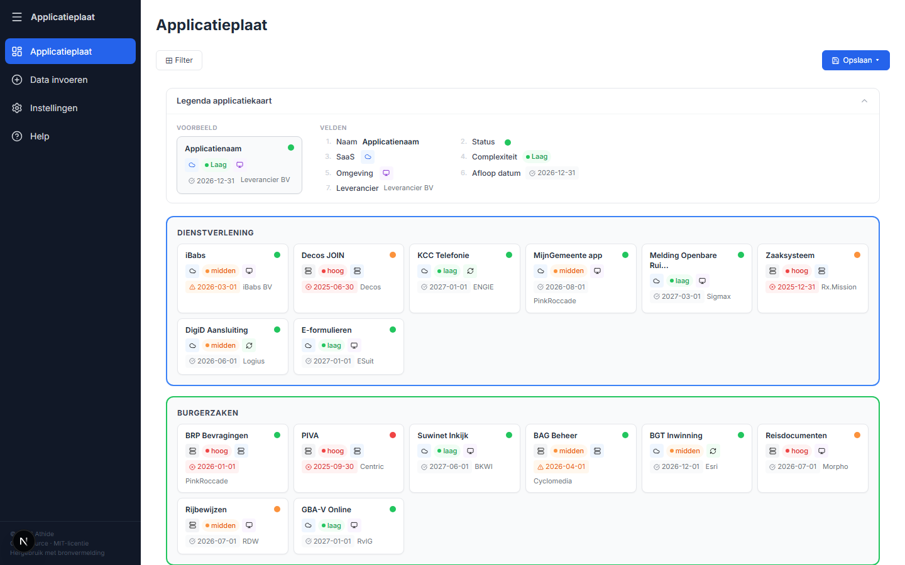

# Applicatieplaat

Een interactieve webapplicatie voor het visualiseren van applicatielandschappen. Breng in kaart welke applicaties jouw organisatie gebruikt, hoe ze gegroepeerd zijn, en welke status ze hebben — alles overzichtelijk op een visuele plaat.



## Kenmerken

- **Visuele applicatieplaat** — Applicaties worden getoond als kaarten, gegroepeerd in clusters (subniveau) en organisatieblokken (hoofdniveau)
- **Flexibele velden** — Definieer zelf welke gegevens per applicatie worden getoond (status, leverancier, omgeving, datums, etc.)
- **CSV-import** — Importeer applicatiegegevens uit CSV-bestanden met kolomkoppeling
- **Filtering** — Filter op elke veldwaarde om specifieke applicaties te vinden
- **Niveau-indeling** — Kies zelf welke kolom als cluster (subniveau) en als organisatie (hoofdniveau) wordt gebruikt
- **Veld-zichtbaarheid** — Bepaal direct vanuit de toolbar welke velden op de kaarten zichtbaar zijn
- **Sessies opslaan/laden** — Exporteer en importeer complete sessies als JSON-bestand
- **PDF/PNG-export** — Sla de plaat op als afbeelding of PDF-document
- **Icoonbibliotheek** — Wijs iconen en kleuren toe aan veldwaarden
- **Volledig client-side** — Geen server of database nodig; alles draait in de browser

## Snel starten

```bash
# Installeer dependencies
npm install

# Start de ontwikkelserver
npm run dev
```

Open [http://localhost:3000](http://localhost:3000) in je browser. Kies op het welkomscherm voor **Standaardomgeving** om met voorbeelddata te starten, of importeer een eigen CSV of sessiebestand.

## Projectstructuur

```
src/
  app/                    # Next.js App Router pagina's
    page.tsx              # Hoofdpagina (applicatieplaat)
    invoer/               # Data-invoer (CSV upload, handmatig)
    instellingen/         # Velddefinities en weergave-instellingen
    help/                 # Documentatie en hulppagina
  components/
    applicatieplaat/      # Plaat, AppKaart, Cluster, Organisatie, FilterPanel, Legenda
    instellingen/         # WeergaveSection, VeldRij, OpslaanBalk
    invoer/               # CSVUpload, KolomMapping, SessionBeheer
    layout/               # AppShell, Sidebar
  lib/                    # Store, CSV-parser, hulpfuncties, standaarddata
  types/                  # TypeScript types
sample/                   # Voorbeelddata (CSV en JSON-sessie)
scripts/                  # Screenshot-generatie (Playwright)
```

## Tech stack

| | |
|---|---|
| Framework | [Next.js 16](https://nextjs.org) (App Router) |
| UI | React 19, inline styles |
| Taal | TypeScript |
| CSV-parser | PapaParse |
| Export | html-to-image, jsPDF |
| Iconen | Lucide React |

## Screenshots maken

Voor de helppagina kunnen automatisch screenshots gegenereerd worden:

```bash
# Start eerst de dev server, daarna:
npx node scripts/screenshots.mjs
```

Dit vereist [Playwright](https://playwright.dev/) (`npm i playwright`).

## Licentie

Dit project is gelicenseerd onder de [MIT License](LICENSE) — Ralph Wagter / [Athide.nl](https://athide.nl)

### Gebruikte open-source packages en licenties

| Package | Licentie |
|---------|----------|
| [Next.js](https://github.com/vercel/next.js) | MIT |
| [React](https://github.com/facebook/react) | MIT |
| [PapaParse](https://github.com/mholt/PapaParse) | MIT |
| [html-to-image](https://github.com/bubkoo/html-to-image) | MIT |
| [jsPDF](https://github.com/parallax/jsPDF) | MIT |
| [Lucide React](https://github.com/lucide-icons/lucide) | ISC |
| [Mermaid](https://github.com/mermaid-js/mermaid) | MIT |
| [clsx](https://github.com/lukeed/clsx) | MIT |
| [Tailwind CSS](https://github.com/tailwindlabs/tailwindcss) | MIT |
